# Angelo

**A click-to-refine sampler for ComfyUI.** Generate an image, then click or paint on regions you want improved. Each click refines just that area while the rest stays bit-exact. One node replaces the standard `KSampler` + post-processing chain. Built and tuned for FLUX 2 Klein 9B distilled (4-step, CFG=1) — but works with any sampler-compatible model.

<a href="https://buymeacoffee.com/lorasandlenses"></a>

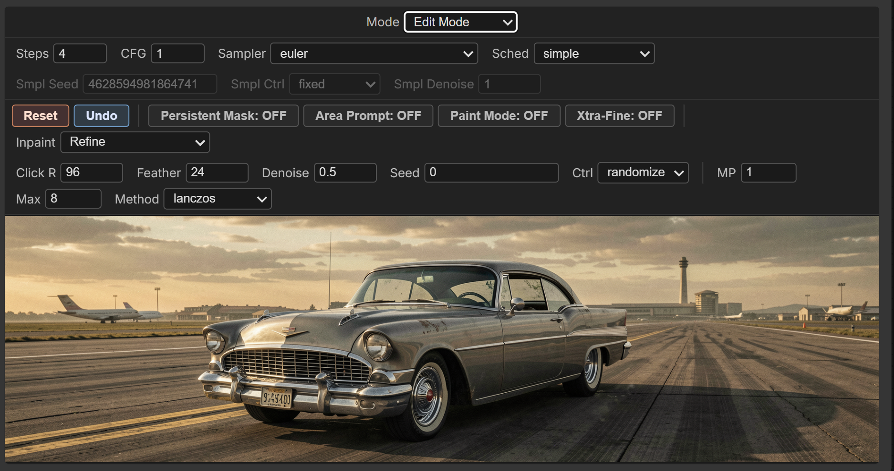

## What it does in one screen

```
                                  ┌─────────────────────────────┐
   Model ──────────►              │     Angelo Node             │
                                  │  ┌───────────────────────┐  │
   Empty Latent ─►                │  │ Mode Steps CFG Sampler│  │  ← gen config row
                   AngeloRefine   │  │ Smpl Seed / Ctrl ...  │  │  ← sampler-seed row
   positive ────►                 │  │ [Reset][Undo] Inpaint▾│  │  ← refine actions
                                  │  │ [Click R][Feather]... │  │  ← refine values
   negative ────►                 │  ├───────────────────────┤  │
                                  │  │ Area Prompt: [______] │  │  ← in-node text box
   vae ─────────►                 │  ├───────────────────────┤  │
                                  │  │                       │  │
   clip ────────►                 │  │   Preview canvas      │  │  ← click / paint / drag
                                  │  │   (fits the node)     │  │
                                  │  └───────────────────────┘  │
                                  └────────────┬────────────────┘
                                               │
                                       latent + image outputs
```

That's the entire workflow. No KSampler upstream, no ADetailer downstream, no Image-to-Mask plumbing in between. Generate, click, done. The image always scales to fit the node — resize the node and the preview tracks it.

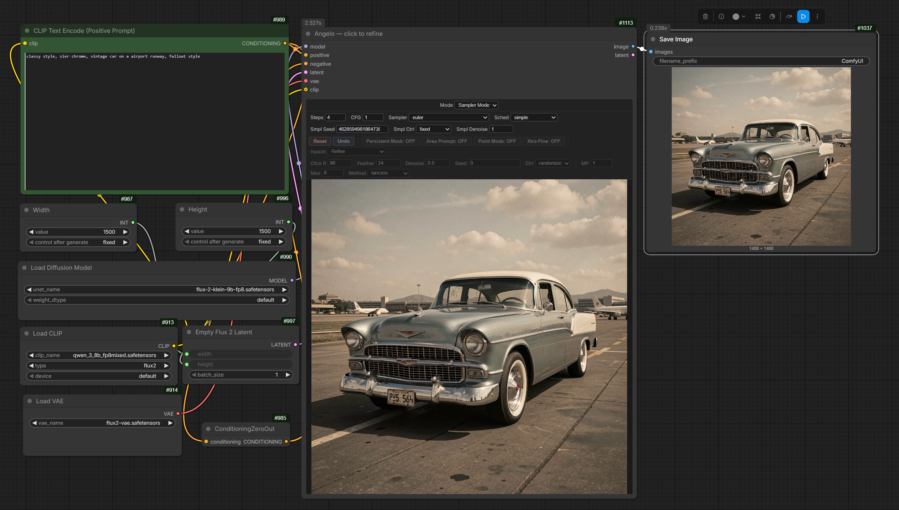

## Why you'd want it

ComfyUI's standard "fix the bad hand" workflow is: generate, save the image, open MaskEditor, paint a mask, route the mask + image + a new sampler config back into the graph, re-queue. It works but it's friction-heavy.

Angelo collapses that into:

- **Click** a region. It refines with your main prompt, in place, immediately.
- **Load Image** to edit an existing photo directly in the node — no Empty Latent or VAEEncode wiring needed.
- **Paint** a freeform stroke with mouse-down + drag. Same thing but custom shape.
- **Type an Area Prompt** right in the node to refine a region with a different prompt (e.g. main prompt = "person in forest", area prompt = "detailed photorealistic face") — no second CLIP Text Encode node needed.
- **Toggle Xtra-Fine** to refine small regions at much higher effective resolution (the ADetailer move, but with full prompt control).
- **Smart Inpaint** — drag a rectangle and add brand-new content with an edit model (FLUX 2 Klein etc.).
- **Smart Guided Inpaint** — no drawing at all: pick a location from a dropdown ("top left", "center", …) + describe what to add, and the edit model places it.
- **Toggle Persistent Mask** + press Queue repeatedly to generate variations of the same region.
- **Undo** to roll back the last refine.

All in one node. All without re-queueing the whole workflow manually for each fix.

## Install

Clone into your `ComfyUI/custom_nodes/`:

```bash
cd ComfyUI/custom_nodes/
git clone https://github.com/shootthesound/ComfyUI-Angelo.git
```

Restart ComfyUI. No additional Python dependencies.

## Quick start (FLUX 2 Klein 9B distilled)

**Just want it running?** Drag [`workflows/Klein9b-example.json`](workflows/Klein9b-example.json) onto the ComfyUI canvas — it's a complete FLUX 2 Klein 9B graph (UNet / CLIP / VAE loaders → Angelo → Save Image) wired and ready. Point the loaders at your model files and queue.

To wire it from scratch instead:

1. Add the **Angelo — click to refine** node from the `sampling/Angelo` category.
2. Wire it up:
   - `model` ← Load Checkpoint / FLUX model loader
   - `latent` ← Empty Latent Image
   - `positive` / `negative` ← CLIP Text Encode nodes
   - `vae` ← Load VAE / your VAE source
   - `clip` ← your CLIP / text encoder (optional, but required for the in-node **Area Prompt** and the Smart modes). Wire the same CLIP that feeds your CLIP Text Encode nodes.
3. Defaults are tuned for Klein 9B distilled: `steps=4`, `cfg=1.0`, `sampler=euler`, `scheduler=simple`. All sampler/generation settings live in the node's toolbar (no native widget rows). Adjust for other models.
4. Mode defaults to **Sampler Mode**. Queue the workflow — Angelo generates the base image.
5. Flip **Mode** to **Edit Mode** (top-left of the toolbar). The refine controls un-grey; cursor becomes a crosshair.
6. Click a region on the preview. Angelo refines that spot.

That's the loop. Click → refine → click → refine. Undo if needed. Reset to start over from the cached base.

## The two modes

### Sampler Mode

Angelo acts as a normal sampler — generates the base image from the incoming latent. The refine control rows are greyed; canvas clicks do nothing. The generation config row (Mode / Steps / CFG / Sampler / Sched) and the Sampler-seed row stay active here:

- **Mode** — flip between Sampler / Edit.
- **Smpl Denoise** — denoise level for the base gen (1.0 = full regenerate from noise, like a normal KSampler).
- **Smpl Seed** + **Smpl Ctrl** — seed value + after-generate control (`fixed` / `randomize` / `increment` / `decrement`).

When you flip Mode to Edit Mode, `Smpl Ctrl` auto-locks to `fixed` and `Smpl Seed` snaps to the seed that actually produced the cached image (preserves it across the mode switch). The Sampler-seed row greys out in Edit Mode.

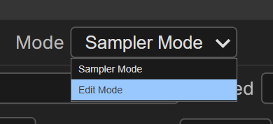

### Edit Mode

The refine control rows come alive. Click, paint, or drag on the preview to refine, depending on the Inpaint mode.

Cursor changes by mode:
- **Crosshair** = single-click refine (Refine) or rectangle drag (Smart Inpaint)
- **Cell** = paint mode active (drag to draw a freeform stroke, Refine only)
- **Default arrow** = Smart Guided Inpaint (no canvas interaction — driven by the location dropdown + Generate button)

Paint Mode lets you brush a freeform region to refine instead of single-circle clicks:

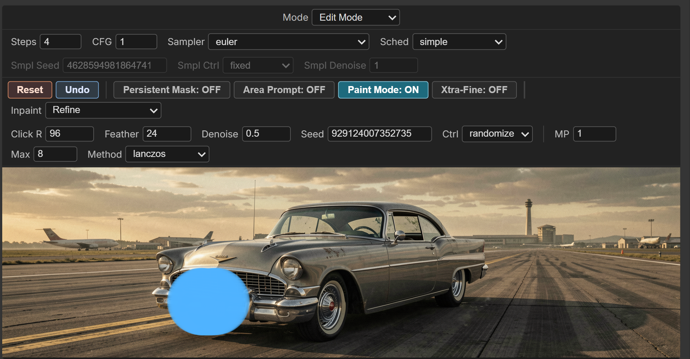

## Load Image (edit an existing photo)

Want to edit a photo rather than something you generated? Hit **🖼 Load Image** in the toolbar, pick a file, and it becomes the base — no Empty Latent or `VAEEncode` chain to wire. The `latent` input is **optional**; Load Image is all you need.

On load you're asked how to size it:

- **Keep current resolution** — encode the photo as-is.
- **Resize to _X_ MP** — scale to a target megapixel (good for taming huge phone photos / saving VRAM).

Either way the dimensions are rounded to a multiple of 16 so any supported VAE is happy. The node then VAE-encodes the photo with the wired `vae`, installs it as the **base**, and switches to **Edit Mode** so you can click / paint / inpaint straight away.

Notes:
- **Reset and Undo return to the loaded photo** (it's the base).
- **While an image is loaded, the `latent` input is ignored.** Hit **✕ Unload** (appears next to Load Image while one is loaded) to clear it and hand the base back to the wired latent.
- The base is in-process state, so a ComfyUI restart clears it — but Load Image re-encodes from the uploaded file, so re-loading is one click.

## Toolbar

The toolbar holds everything — there are no native widget rows. Top to bottom, grouped into a centred Mode switch, a generation block, and an edit block:

```
                 ┌─────────────────┐
                 │  Mode: [Edit ▾] │            ← centred at the top
                 └─────────────────┘
  [Steps] [CFG] [Sampler ▾] [Sched ▾]            ← shared generation config (always active)
  [Smpl Seed] [Smpl Ctrl ▾] [Smpl Denoise]       ← base-gen seed (greys in Edit Mode)
 ─────────────────────────────────────────
  [Reset] [Undo] | [Persistent Mask] [Area Prompt] [Paint Mode] [Xtra-Fine] | [Inpaint ▾]
  [Click R] [Feather] [Denoise] [Seed] [Ctrl ▾] | [MP] [Max] [Method ▾]    ← edit block (greys in Sampler Mode)
```

The **Mode** switch sits centred up top. Below it, the generation block (always active, base-gen seed greys in Edit Mode); below the divider, the edit block (greys entirely in Sampler Mode). Every control has a hover tooltip. Quick reference:

### Mode + generation block

| Control | What it does |
|---|---|
| **Mode ▾** | Sampler Mode (generate the base) vs Edit Mode (click/paint/drag to refine). Centred at the top of the node |
| **Steps / CFG / Sampler ▾ / Sched ▾** | Sampler config, shared by base gen and refines. Klein 9B distilled: 4 / 1.0 / euler / simple |
| **Smpl Seed / Smpl Ctrl ▾ / Smpl Denoise** | Seed, after-generate control, and denoise for the base generation (Sampler Mode) |

### Edit block — actions + toggles

| Control | What it does |
|---|---|
| **Reset** | Discard cached refinements + history, start fresh from the Sampler-Mode base |
| **Undo** | Pop the most recent refine off the history stack (up to 10 deep) |
| **Persistent Mask** | Snapshot the current mask. Hit Queue repeatedly to get variations of just that region (combine with `Ctrl=randomize`). Locked OFF in Smart Guided Inpaint (no mask) |
| **Area Prompt** | Refine with the Area Prompt text typed in the box above the canvas (encoded with the connected `CLIP`) instead of the main prompt. Requires a `CLIP` input + non-empty text. The box only appears when this is ON. Forced ON in both Smart modes |
| **Paint Mode** | Hold + drag to paint a freeform stroke as the mask, instead of single-circle clicks (Refine only) |
| **Xtra-Fine** | Crop the painted region, upscale via VAE + image upscale, refine at high effective resolution, composite back. ADetailer-style. Forced ON in Smart Inpaint, OFF in Smart Guided Inpaint |
| **Inpaint ▾** | `Refine` / `Smart Inpaint` / `Smart Guided Inpaint`. See "Inpainting Mode" below |

### Edit block — refine values

| Control | What it does |
|---|---|
| **Click R** | Pixel radius for single-click refines + brush size in Paint Mode |
| **Feather** | Pixel-space gaussian feathering on the mask edge for smooth transitions. Defaults to 0 (and is adjustable) in Smart Inpaint; disabled in Smart Guided Inpaint |
| **Denoise** | How much trajectory to run on the refine (0.3 = subtle, 0.6 = real redo, 0.9+ = regenerate). Locked to 1.0 in both Smart modes |
| **Seed** + **Ctrl ▾** | Seed for the refine pass + after-generate control. Defaults to `randomize` so each refine is a fresh variation |
| **MP** | (Xtra-Fine only) Target megapixels for the refine pass |
| **Max** | (Xtra-Fine only) Hard cap on linear upscale factor (8× linear = 64× area) |
| **Method ▾** | (Xtra-Fine only) Pixel-space upscale method. Default lanczos. |

## Xtra-Fine (the killer feature)

Standard refine runs the model on the full latent. The mask only decides where output is written; the model sees the whole image as context. That's great for general refinement but it means a small region (a face, a hand) is only ~64 latent units wide — well below where FLUX renders detail well.

Xtra-Fine does what ADetailer does, but inside the same Angelo loop:

1. Compute the painted-mask bbox + a context-padding band of surrounding pixels for context.
2. VAE-decode the cached latent to pixels.
3. Crop the pixel image to that padded bbox.
4. Upscale the crop in pixel space to hit `MP` megapixels (capped at `Max` linear scale).
5. VAE-encode the upscaled crop → high-resolution latent.
6. Refine just the painted shape inside it via the standard noise-injection inpaint path.
7. VAE-decode, downscale, composite back into the cached pixel image.
8. VAE-encode the composited image AND blend with the cached latent using the mask as alpha — so the unaltered regions stay bit-exact (no VAE round-trip drift).

The result: a face that was 64 latent units gets refined at ~1000 latent units (depends on `MP` + `Max`). The model finally has room to render fingers, eyes, teeth correctly.

**Pair with Area Prompt** for a workflow Lightroom users will recognise: paint a region, type "detailed photorealistic face" in the Area Prompt box, click. Same image, that region transformed at full quality with the override prompt.

### When to use Xtra-Fine — and the size floor

**Rule of thumb: if the thing you're improving is small, turn Xtra-Fine ON.** A distant face, an eye, a hand, jewellery, text on a sign — anything that occupies only a small slice of the frame. In plain Refine those pixels map to just a handful of latent cells and the model has no room to render detail; Xtra-Fine crops them out and enlarges them to a full working canvas (the `MP` target, default ~1 MP ≈ 1024²) before refining, then composites back. For large regions plain Refine is already fine and faster.

**Mind the VAE size floor.** The VAE downsamples by **16× on FLUX 2** (8× on FLUX 1 / SDXL / SD 1.5), so the region the model actually works on needs enough latent cells to encode meaningful detail. Practical guidance:

- Aim for the refined region to land at **roughly 512–1024 px on its short edge** after the Xtra-Fine enlarge. On FLUX 2 that's ~32–64 latent cells — enough for coherent detail. The default `MP` ≈ 1024² gets you there for most paints.
- The enlarge is **capped at `Max` linear scale (default 8× = 64× area)**. So an extremely tiny paint can't be blown up without limit: a ~40 px region maxes out around ~320 px even at 8×, which is near the floor and will look soft. **Paint a little wider** (or raise `Max`) so the crop — and the VAE — have room to work.
- Below ~256 px effective working size, expect mush: there simply aren't enough latent cells for the model to put detail into, no matter the prompt.

In short: Xtra-Fine is what makes *small* fixes possible at all, but it can't conjure resolution from nothing — give it a crop that enlarges to a few hundred pixels minimum.

## Persistent Mask (re-roll the same region)

Toggle on, then hit the standard ComfyUI Queue button repeatedly. Each press refines the same masked region with a fresh seed (if `Ctrl=randomize`) or the same seed (if `Ctrl=fixed`).

The source latent is **snapshotted** at the moment Persistent Mask starts iterating, so variations are real — every Queue starts from the same base, not from the previous variation. This means:

- `Ctrl=fixed` + Queue, Queue, Queue → **same** variation every time (idempotent)
- `Ctrl=randomize` + Queue, Queue, Queue → **N different variations** of the same base
- `Ctrl=increment` + Queue, Queue, Queue → predictable progression

A new click while Persistent Mask is on commits a new region — the post-click result becomes the new snapshot.

## Inpainting Mode (Refine / Smart Inpaint / Smart Guided Inpaint)

Three options for how a region is treated. The two Smart modes need an **edit model** (FLUX 2 Klein 9B etc.) and a wired `CLIP`.

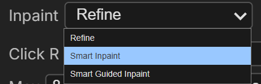

| Mode | What it does | Use for |
|---|---|---|
| **Refine** (default) | Painted/clicked region is the starting state — the model partially denoises the existing pixels per the denoise level. Mask is a click circle or a paint stroke. | Face/hand fixes, polish, style adjustments, **editing what's already there** |
| **Smart Inpaint** | Drag a rectangle (click + hold one corner, release at the opposite). Locks `denoise=1.0`, `Xtra-Fine=ON`, `Area Prompt=ON`. Injects `reference_latents` so an edit model's edit branch activates, then zeros the masked latent so the region regenerates from full noise. | **Adding new content** in a specific drawn region |
| **Smart Guided Inpaint** | No painting or boxes. Pick a **location** from a dropdown ("Top left", "Center", "Bottom half", …); it's prepended to your Area Prompt at run time (e.g. *"In the top left of the image, a red car"*) and the edit model places it across the whole image. Locks `denoise=1.0`, `Xtra-Fine=OFF`, `Area Prompt=ON`; press **Generate Guided Edit** to run. | **Adding new content** when you don't want to draw — quick, coarse placement |

### Why Smart Inpaint exists

An edit model like FLUX 2 Klein has no concept of a mask — it takes a reference image + a prompt and produces an edited image. The painted shape only constrains *where the result is composited*, not what the model generates. Smart Inpaint addresses this by (a) cropping to the dragged rectangle so the model's working region is the area you care about, (b) injecting the scene as `reference_latents` so the edit branch sees the surrounding context, and (c) zeroing the masked latent so the model fills it as new content rather than refining what was there.

Typical "add a person on the road" workflow:

1. **Inpaint Mode: Smart Inpaint** (auto-locks denoise=1.0 / Xtra-Fine=ON / Area Prompt=ON)
2. **Drag a rectangle** roughly where the person should go — make it generously larger than the subject so the body isn't clipped at the rectangle edge
3. Type the **Area Prompt** (the box appears above the canvas): `"a person walking, full body, realistic, matching the scene's lighting"`
4. **Queue**

Rectangles beat tight silhouettes here: the composite keeps only what lands inside your shape, so a person-shaped mask clips any body part the model drew outside it. A generous rectangle gives the model room to compose a complete subject.

Example — drag a rectangle over the wheel, prompt `"wheel engulfed in flames"`, run:

<table>
<tr><td align="center"><b>Before</b> (rectangle + prompt)</td><td align="center"><b>After</b></td></tr>
<tr><td>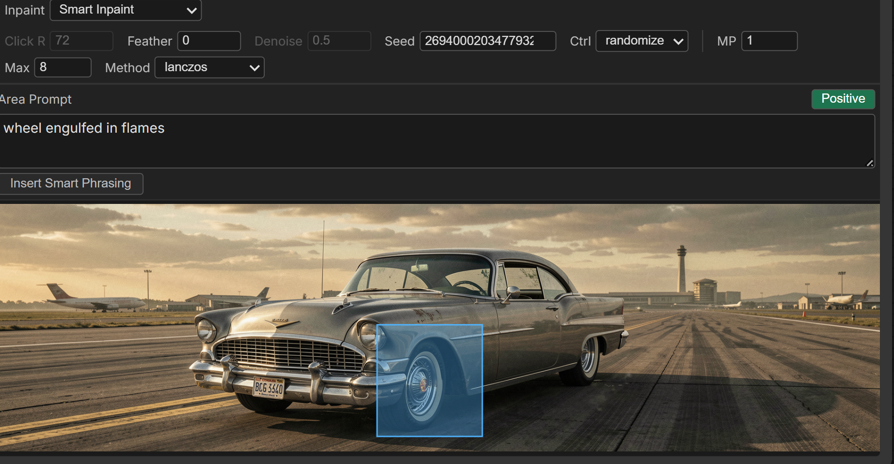</td><td>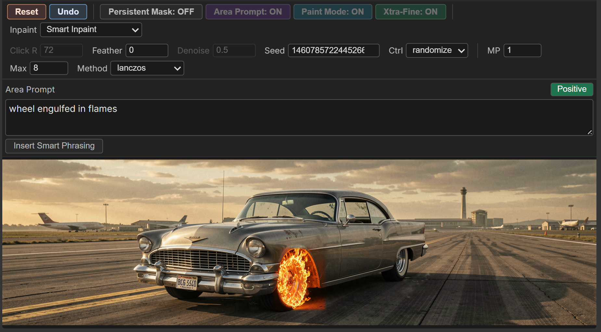</td></tr>
</table>

### Smart Guided Inpaint — placement by words, not boxes

The same edit-model plumbing as Smart Inpaint, but the spatial "where" comes from a dropdown + prompt phrasing instead of a drawn region. There's no mask at all — the whole image is edited, with `reference_latents` keeping the rest faithful and the location prefix telling the model where to put the new content.

1. **Inpaint Mode: Smart Guided Inpaint**
2. Pick a **Location** from the dropdown above the Area Prompt box (corners, middles, center, edges, halves, top/bottom)
3. Type what to add in the **Area Prompt** box
4. Press **Generate Guided Edit**

Example — Location `Right edge`, prompt `"A sheep jumping up and down"`, hit Generate Guided Edit:

<table>
<tr><td align="center"><b>Before</b> (location + prompt)</td><td align="center"><b>After</b></td></tr>
<tr><td>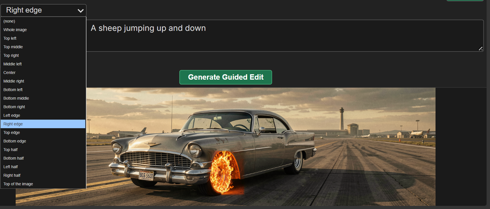</td><td>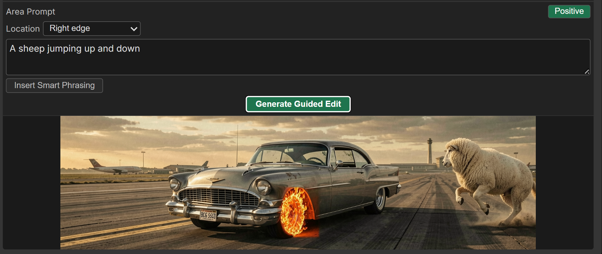</td></tr>
</table>

Honest expectations: text-based placement is fuzzy by nature. Coarse regions ("top half", "bottom of the image", "center") land most reliably; fine ones are looser. FLUX 2 Klein honors these phrases well in practice. Use Smart Inpaint when you need *precise* placement, Smart Guided when you want a *quick, no-draw* edit.

**Insert Smart Phrasing** (a button under the Area Prompt box, shown in both Smart modes) opens a popup of edit-preservation constraints — *keep the lighting / pose / clothes / faces the same* — and appends the ticked ones to your Area Prompt. Handy for keeping the rest of the subject stable while changing one thing.

<table>
<tr><td align="center"><b>Tick the constraints</b></td><td align="center"><b>Appended to the Area Prompt</b></td></tr>
<tr><td>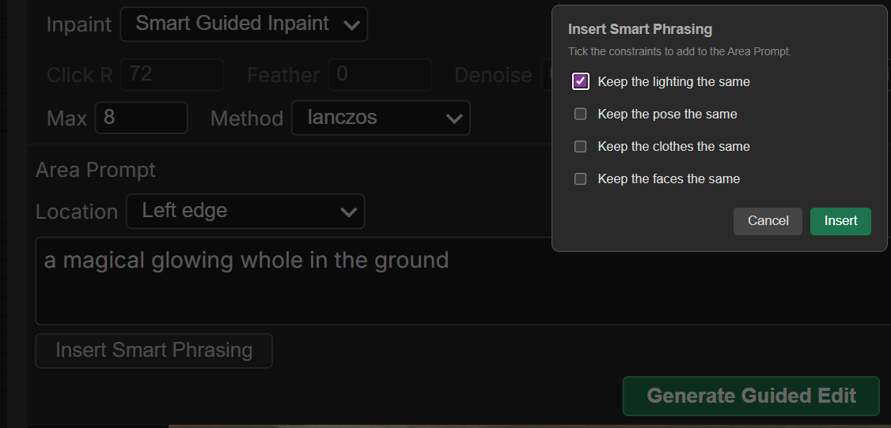</td><td>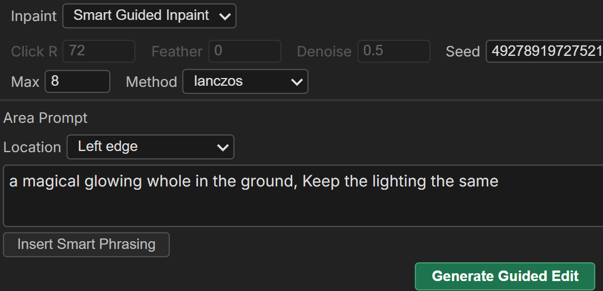</td></tr>
</table>

…and the run (Location `Left edge`, *"a magical glowing whole in the ground, Keep the lighting the same"*) puts the glow on the left while leaving the rest of the scene intact:

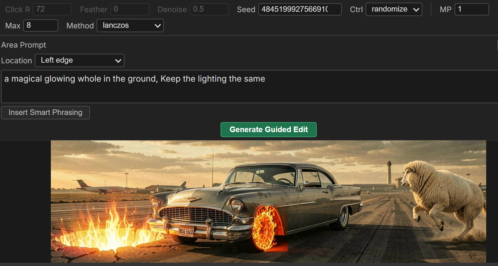

## Area Prompt (refine with a different prompt)

Connect a `CLIP` (the same one feeding your main positive/negative). Toggle **Area Prompt** on — a text box appears between the toolbar and the canvas. Type a prompt; refines encode it with the CLIP and use it instead of the main prompt. Toggle off → the box hides and refines revert to the main prompt. Hiding the box never loses what you typed (it lives in the node and reloads), and the cached image persists across the toggle.

The box has a **Pos/Neg** toggle that switches which prompt you're editing. Negative is optional and falls back to the main negative when empty (matters only for CFG > 1; ignored at CFG=1 / distilled models like Klein — which is why it's tucked behind a toggle rather than a second always-visible box).

Both Smart modes force Area Prompt ON (it's the whole point there), and add an **Insert Smart Phrasing** button for the *keep X the same* constraints. Smart Guided Inpaint also adds the **Location** dropdown directly above the box.

Recommended: use `denoise=0.7-0.9` for area-prompt refines in **Refine** mode. Lower values won't give the new prompt room to take effect against an image generated with a different prompt. (Both Smart modes lock denoise=1.0 since they're regenerating from scratch.)

## Navigating the preview (zoom & pan)

The preview fits the node by default, but you can zoom in to work on fine detail:

| Action | Does |
|---|---|
| **Mouse wheel** | Zoom in / out, centered on the cursor (0.25×–8×) |
| **Middle-mouse hold + drag** | Pan around |
| **Double middle-click** | Reset back to fit |

When you zoom in (>1×), a small **minimap** appears in the bottom-right corner showing the whole image with a marker for your current viewport. Click-to-refine, paint, and rectangle-drag all keep working while zoomed — clicks land on the correct image pixel at any zoom — so you can zoom into a face, click to refine, and stay zoomed for the next click.

While you're zoomed or panned, the **auto-fit is suspended** so resizing the node won't snap your view back. A genuinely new image (or double-click reset) returns to fit; refining the *same* image keeps your zoom.

## Keyboard shortcuts

When the cursor is hovering the preview canvas AND you're in Edit Mode, these keys adjust the matching toolbar values directly:

| Keys | Adjusts | Step | Convention |
|---|---|---|---|
| `[` / `]` | Click R | 4 px | Universal brush-size (Photoshop, Krita, Procreate) |
| `{` / `}` (shift+brackets) | Feather | 4 px | Photoshop brush hardness/softness |
| `,` / `.` | Denoise | 0.05 | `<` / `>` ordering on the same keys |

The hover ring on the canvas updates live as you press `[` / `]`, so you can size the brush against the actual image content. Shortcuts only fire while the cursor is on the canvas; move to the toolbar and they revert to ComfyUI's normal keybindings.

## Tips

- **Default denoise (0.5) is for in-place touch-ups.** Bump to 0.85+ when you want a clear redo of the region (mandatory for Area Prompt; helpful for Xtra-Fine). Both Smart modes lock it to 1.0.
- **Click R + Feather scaling.** Feather ≈ `Click R / 4` works well as a starting point.
- **The preview always fits the node** (until you zoom). Resize the node and the image scales to fit (letterboxed), so a portrait image no longer forces a giant tall node. Wheel-zoom + middle-drag to inspect detail — see "Navigating the preview".
- **Lanczos is the default for Method.** For smooth content (faces, skin), try bilinear too — sometimes preferable on very soft subjects.
- **The refine controls grey out in Sampler Mode** (and the base-gen seed row greys in Edit Mode) so you can see at a glance which mode you're in.
- **Lock-on-fixed seed semantics.** Switching to `fixed` always also restores the seed widget to the value Python actually used at the last run — so "fixed" always means "the seed that produced the current canvas".
- **`Reset` discards undo history too.** Hit Undo first if you just want to roll back one refine.

## Honest limits

- **In-process state.** Refinements live in the running ComfyUI process. Restart = cache cleared. Workflow JSON saves widget values but not the cached refined latent.
- **VAE round-trip cost in Xtra-Fine.** ~1.5-2 seconds per click on a 5090 for FLUX 2 Klein. Trade-off for the resolution boost; OFF mode stays fast.
- **Crop+upscale is bounded by the model's training distribution.** Very small painted regions even at 8× upscale won't suddenly look like trained-resolution content. Paint wider so the crop carries more surrounding context.
- **One Angelo node per ComfyUI instance is sensible.** Multiple parallel Angelo nodes would share the global queue hook and may interact in surprising ways under Persistent Mask.
- **No multi-user safety.** Don't use this on a shared ComfyUI server expecting per-user state isolation.

## Compatibility

- **ComfyUI:** any reasonably modern version (the JS uses standard ComfyUI extension APIs).
- **Models:** any sampler-compatible model. Defaults are tuned for FLUX 2 Klein 9B distilled, but works with FLUX 1, FLUX 2 Dev, SDXL, SD 1.5, etc. — change `steps` / `cfg` / `sampler_name` / `scheduler` to match your model.
- **VAE:** FLUX 2 (16× downscale), FLUX 1 / SDXL / SD 1.5 (8× downscale) handled automatically. Exotic VAEs may need a small code change.
- **GPU:** any CUDA GPU that runs your base model. Angelo adds minimal overhead.

## Credits + contact

Built by Peter Neill ([shootthesound](https://github.com/shootthesound)).

Bug reports, feature requests, and "this changed how I work" stories all welcome via GitHub issues.

If Angelo saves you time, you can support development here:

<a href="https://buymeacoffee.com/lorasandlenses"></a>

## License

MIT.
